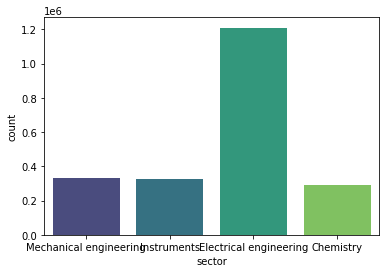
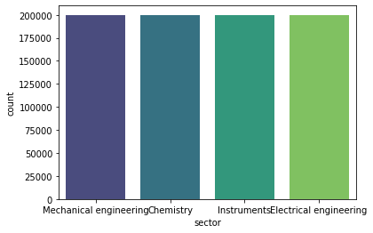
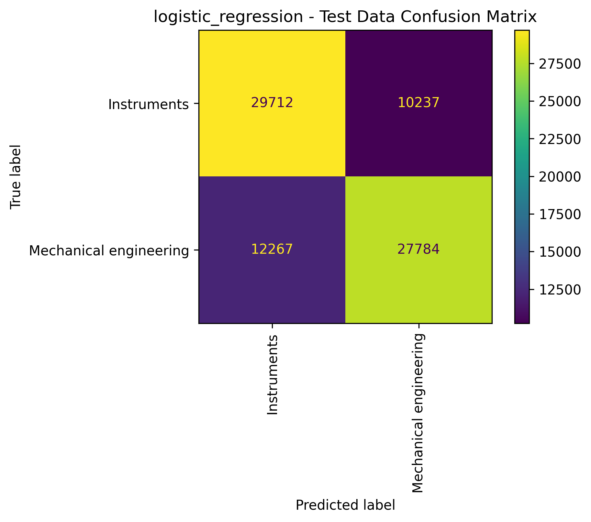
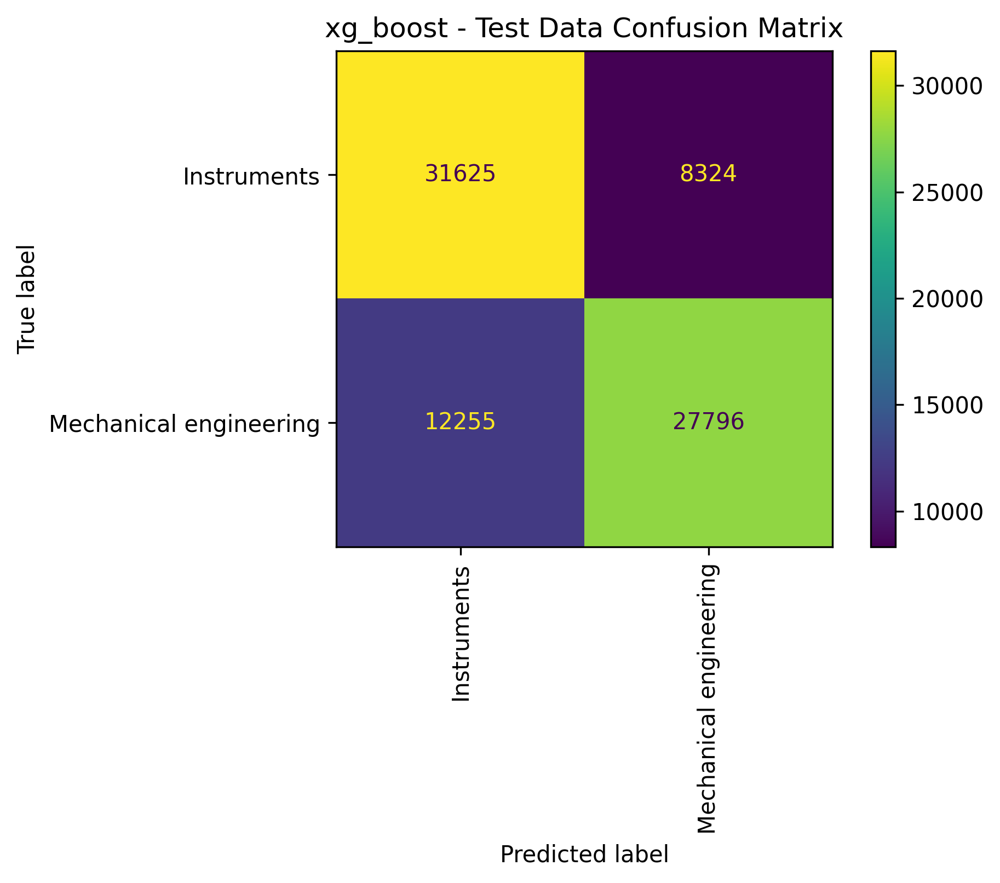
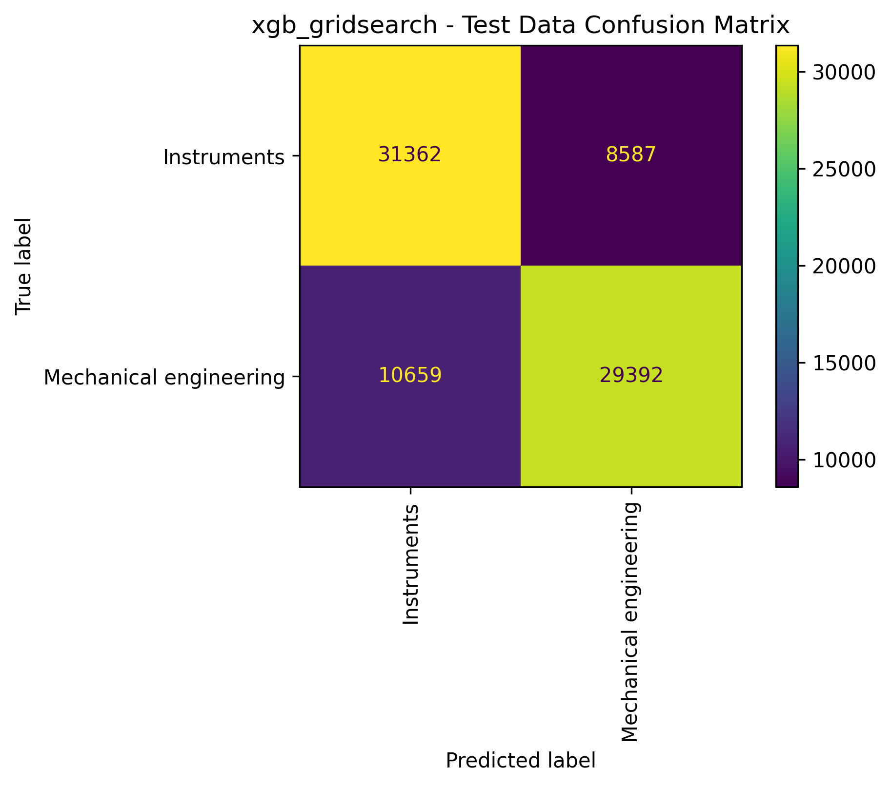
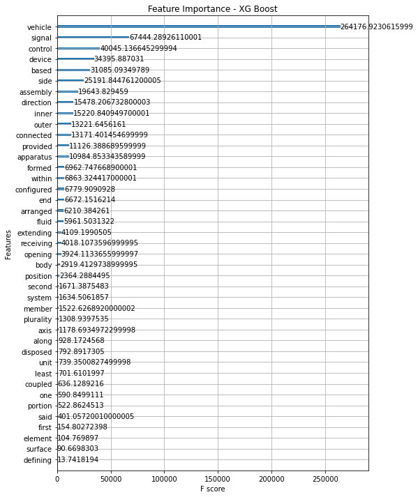
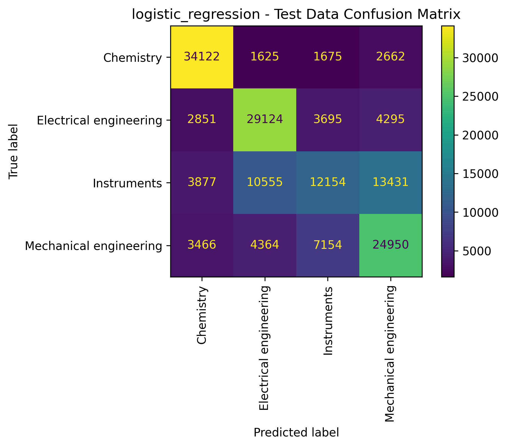
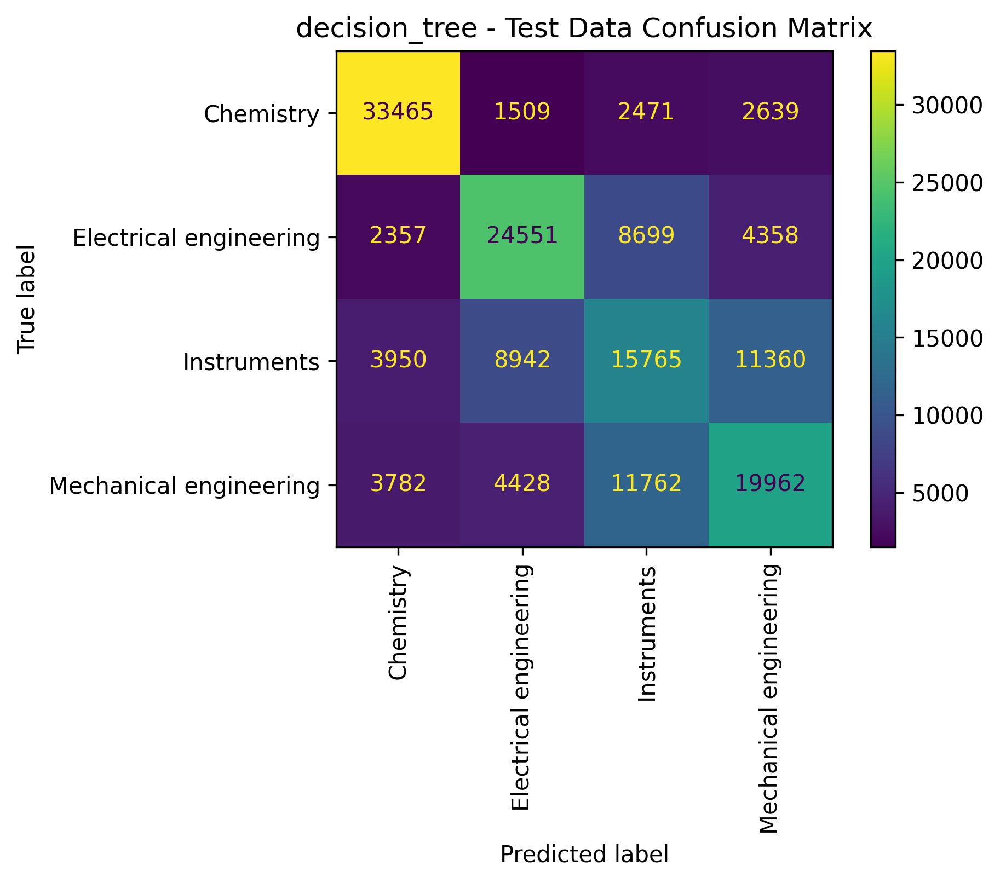
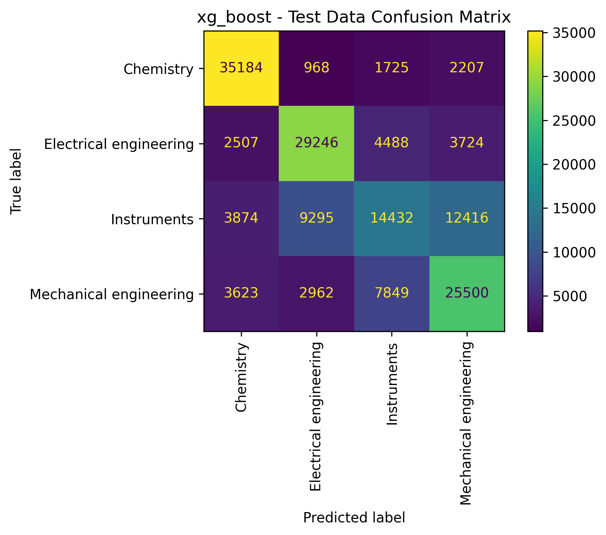
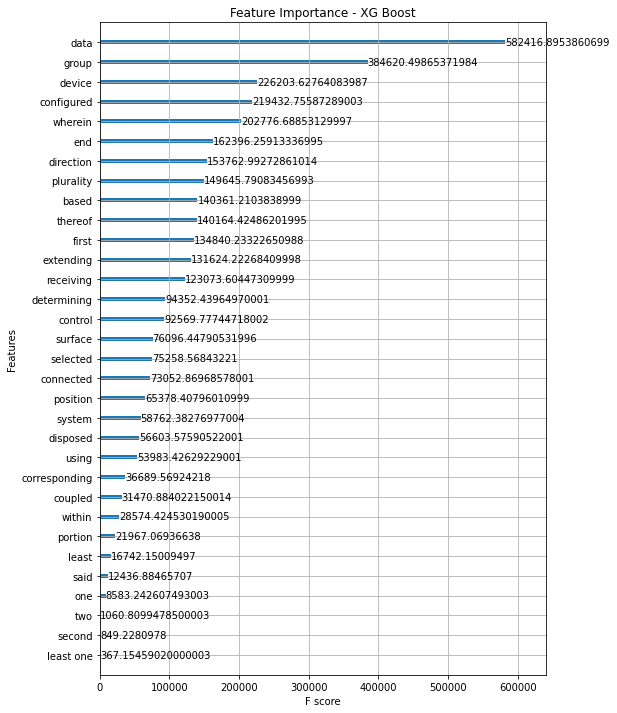

# Using NLP to predict patent classification

## Business Understanding
Patents provide a wealth of data since their data has been compiled by a variety of parties in a variety of ways, both public and private. To name a few, public patent data can be accessed via websites for the U.S. Patent & Trademark Office (USPTO), foreign patent offices, Google Patents, etc. Data for this project has been obtained from [PatentsView.org](PatentsView.org), which is a visualization, data dissemination, and analysis platform provided by the USPTO.

Various types of information on patents are connected at various stages in a patent's life, one being the classification of a patent's technology (e.g. mechanical, chemistry, electrical, etc.) This classification is assigned by the patent Office some time after a patent is filed, but it could be useful to automate the classification process. In this project, I will be attempting to use machine learning to predict classifications. There are many types of classification systems ranging from broad to very specific, so for the purposes of this project, I will focus on a broader classification system.

## Data Understanding
To provide some background on how a patent is structured, there are 4 main parts. They are:
1) Coverpage, which provides bibliographic information such as who the inventors are, what the title is, a summary, what patents are related, etc.;
2) Specification, which provides background information on the given invention;
3) Drawings, which serve to illustrate the invention; and
4) Claims, which detail the specific aspects of an invention that the applicant wants legally protected.

Here is a link to patent [#10 million](https://patentimages.storage.googleapis.com/c0/d5/f7/86ad5b42759506/US10000000.pdf) if you are curious what the actual document looks like.

I mention these because in this project, we will use the first claim of U.S. patents to predict the classification. Claims are much shorter and more specific than the entire specification (a few lines vs. many page) and follow a similar grammatical structure. This structure is a product of patent attorneys seeking to obtain specific and predictable legal protections, and may help in pattern recognition. Alternatively, the styles of the specifications are highly personalized to the author of the patent since the rules for the contents are not as rigid. Lastly, since each patent is required to contain at least one claim, we are guaranteed that there will not be missing data for any given patent we are analyzing.

## Data Preparation
Currently, there have been over 10 million patents granted in the U.S., so the first thing to do is reduce the amount of data being used for modeling since I am limited to what Google Collab can run in a couple hours. The parameters I used to select the data for training are:
1) Patents from the last 10 years. This provides more than 3 million patents for further trimming.
2) Using the World Intellectual Property Organization's (WIPO) classifications, found [here](https://patentsview.org/download/data-download-tables), which are the broadest having only 5 classifications:
    - Electrical engineering
    - Mechanical engineering
    - Instruments
    - Chemistry
    - Other (which patents I eliminated since I wanted to focus on data with an actual label)

Below is a breakdown of the number of cases I had for each classification.

Image by author.

I then trimmed all the classes to have the same amount of cases in each classification since I had plenty of data.

Image by author.

3) Getting rid of patents having more than one classification. For this purpose, I had enough data to rely patents belonging to only one class.

4) Keeping only the first claim for each patent. The first claim is typically considered the most important, and a smaller amount of data should reduce the computing power required.

## Modeling & Evaluation
I wanted to look at how a few different sets of models and also compare how they would perform in dual or multiclass situations.

### Dualclass
I will focus on looking at the accuracy since the classes are balanced, and no classes are more important than the others to get correct.

#### Model 1 - Logistic Regression
For my first model, I used logistic regression, and below are the results from the model.

Training Accuracy: 71.67% 
Test Accuracy: 71.87%

Confusion Matrix for test data: 

Image by author.

#### Model 2 - Decision Tree
For my second model, I used a decision tree classifier. Below are the results.

Training Accuracy: 99.35% 
Test Accuracy: 68.48%

Confusion Matrix for test data: 

Image by author.

#### Model 3 - XG Boost
For my third model, I used a gradient boosted model, XG Boost. Below are the results.

Training Accuracy:74.2% 
Test Accuracy: 74.27%

Confusion Matrix for test data: 

Image by author.

#### Model 3a - Grid Searched XG Boost

Comparing the scores, the XG Boost model is the most promising, so running a gridsearch to optimize parameters, we get the following.

Training Accuracy:74.2% 
Test Accuracy: 74.27%

Confusion Matrix for test data: 

Image by author.

We now want to look at the words that were most important in determining the classification.

Feature importance for XG Boost: 

Image by author.

The algorithm seems to have picked up on technical keywords like "vehicle" and "signal", but also interestingly seems to have picked up on stylistic words like "provided" and "within".

Now, let's look at what the major influences on the multiclass model look like.

### Multiclass
For my multiclass models, I am relying on accuracy for my metric because my classes are balanced, and no classes are more important than the others to get correct.

#### Model 1 - Logistic Regression
For my first model, I used logistic regression, and below are the results from the model.

Training Accuracy: 62.67% 
Test Accuracy: 62.71%

Confusion Matrix for test data: 

Image by author.

#### Model 2 - Decision Tree
For my second model, I used a decision tree classifier. Below are the results.

Training Accuracy: 96.12% 
Test Accuracy: 58.58%

Confusion Matrix for test data: 

Image by author.

#### Model 3 - XG Boost
For my third model, I used a gradient boosted model, XG Boost. Below are the results.

Training Accuracy: 65.22% 
Test Accuracy: 65.22%

Confusion Matrix for test data: 

Image by author.

Comparing the scores, the XG Boost model is the most promising, so running a gridsearch to optimize parameters, we get the following.

Training Accuracy: 68.53% 
Test Accuracy: 66.98%

Confusion Matrix for test data: 

Image by author.

We now want to look at the words that were most important in determining the classification.

Feature importance for XG Boost: 

Image by author.

With 4 classes, the algorithm seems to have picked up on technical keywords like "data" and "device", but also interestingly seems to have picked up on stylistic words like "configured" and "wherein".

## Evaluation
### Results
Based on the performance metrics for both the 2-class and 4-class models, the XG Boost model performed the best. As for what determined a classification, it appears to be a mix of keywords but also stylistic choices that practioners of each technology area lean towards.

### Recommendations
- Use machine learning to help automate the classification process for patent Offices or third parties.
- Practioners could use the model for a quick check of how their patent will be classified before it is filed.

## Deployment
For More Information, please review my full analysis in Jupyter Notebook or my presentation.

For any additional questions, please contact Catherine Fritz: cmfritz0@gmail.com.
